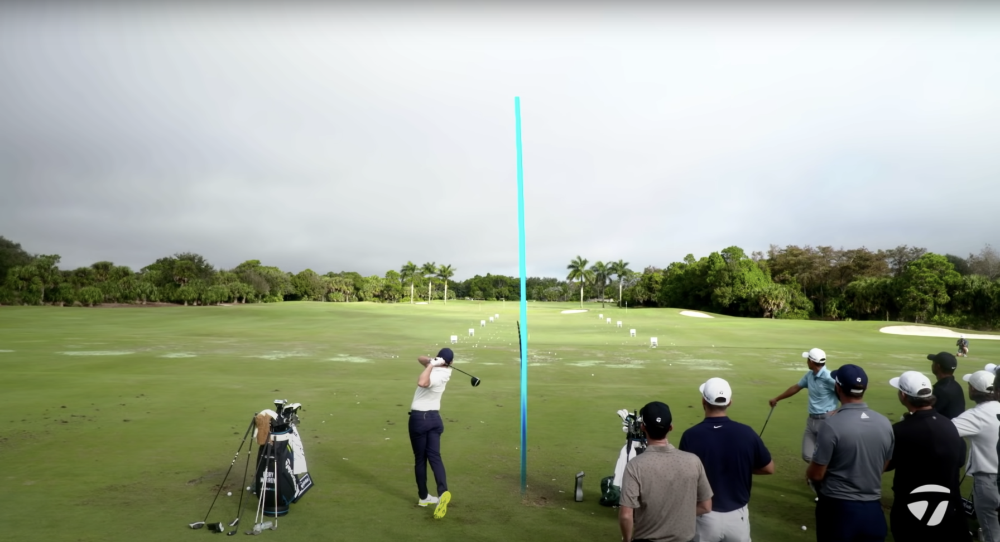
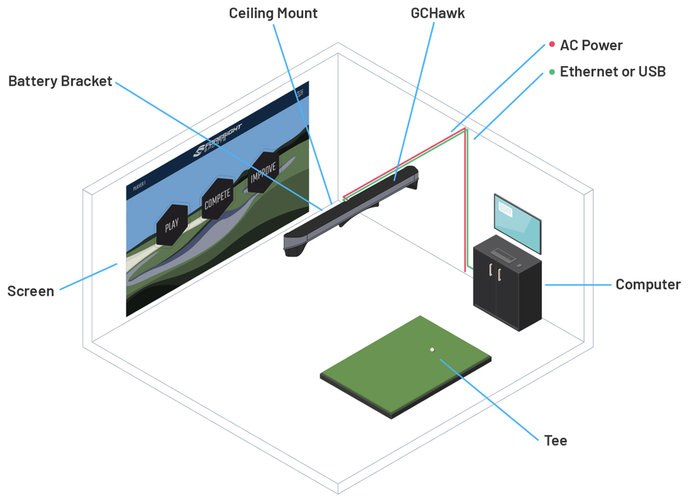
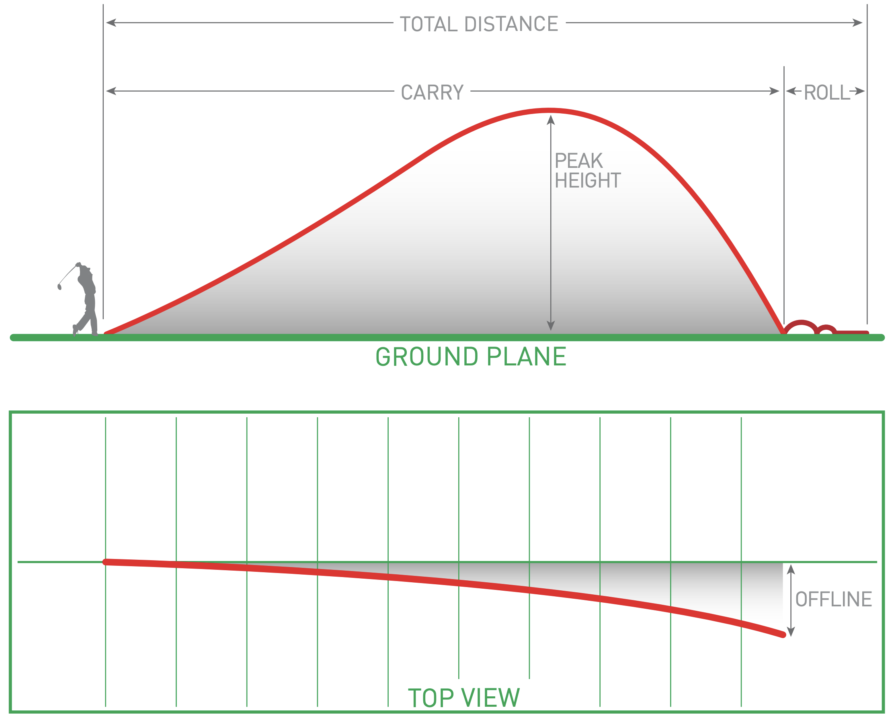

# Predicting Golf Ball Carry Distance from a Launch Monitor

Josiah Duhaime

---

## Background

Launch monitors use highspeed, high-resolution cameras to capture ball
launch conditions with a high degree of accuracy. These data is then used to
predict the direction and distance of the golf ball. This information, coupled
with proper instruction, can be used to optimize one's golf swing to provide
creater control of the distance the ball travels and increase the ball's
distance. Further, the data collected from a launch monitor is frequently used
to simulate playing golf in indoor and outdoor environments. This is especially
apparent with the recent rise of [Top Golf](https://topgolf.com/us/).

---

## Goals

* Attempt to recreate a proprietary algorithm
* Increase understanding of ML models

---

## Data

The data was obtained from a privately owned
[ForeSight GCHawk](https://www.foresightsports.com/gchawk) and was requested
by the owner not to be shared publically.

The data was formatted as .json files containing user data and launch monitor
data from numerous golf swings. There were 10 features and 10,467 observations.
Unfortunately, there were 1,878 total instances were the system was started but
there were now golf swings executed. These were excluded from analysis.

### Features

* Ball Speed: Meters per Second
    * The measurement of the golf balls velocity measured just after impact
* Azimuth: Degrees
    * The initial horizontal angle relative to the target line
* Launch Angle: Degrees
    * The initial vertical angle of ascent relative to the ground plane measured in degrees
* Back Spin: Revolutions per Minute
    * Rotation opposite to the direction it is flying
* Side Spin: Revolutions per Minute
    * Rotation sideways or horizontal to the direction it is flying
* Total Spin: Revolutions per Minute
    * The total amount of spin around the spin axis that creates curvature and lift
* Spin Axis:  Degrees
    * The axis that the golf ball rotates around to create shot curvature and lift.
* Offline Distance: Meters
    * The end position distance right or left measured from the target-line
* Max Height: Meters
    * The apex of the trajectory measured from the ground plane
* Descent Angle: Degrees
    * The vertical angle the ball descend from the apex
* Club Type:
    * Driver
    * Fairway Wood
    * Hybrid
    * Iron
    * Wedge

**Note: The club type was not used for analyses due to apparently errant data.**

For example, there was logged wedge data that had a flight path consistent with
a driver. Due to the quality of the data, a determination was made to trust the
launch monitor data and to attribute the classification error to human error.

### Target

* Carry Distance: Meters
    * The total distance of flight produced by initial launch condition

---

## Data Visualization

As seen in `Figure 1`, there are several features that have an apparent linear
relationship with the target.

**Figure 1: Comparison of Ball Speed and Max Height Against Carry Distance**

---

## Statistics

---

## Model

### Model Performance

---

## Conclusions

---

## Next Steps

* Add UI interaction declaring limiting feature of carry distance
* Feature creation
* Access raw data
* Comparision against other launch monitors
* Incorporate weather

## TODO

* Calc distance with physics
* Use ML

## Notes

* Missing data: 1878 files
    * System started without any shots taken
* dropping putter strokes
    * <1% of data
    * Different swing mechanics
* Some errant club data noted
    * eg 300 m wedge
    * Likely artifact of not switching the club selected
    * otherwise the data is sound
